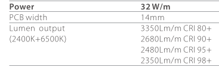
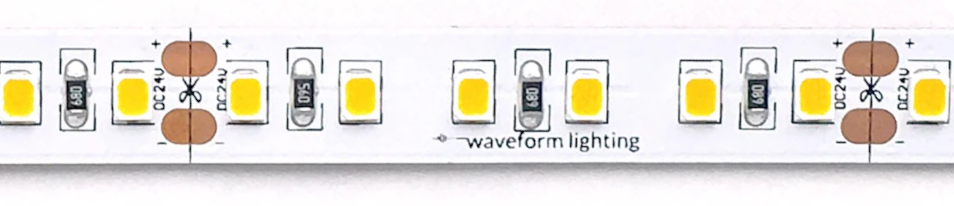
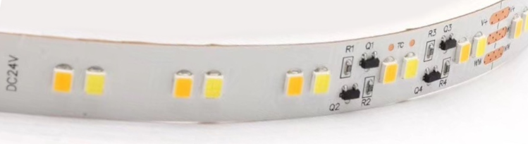
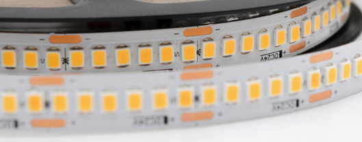

# Introduction / Motivation

Most people use LED strips only for decorative/moon lighting (with intense colours but not very bright). I have done this too. But I thought why not replace all lighting with LED strips?

By now, most people have heard that reducing artifical or blue or any light during the evening can improve the sleep quality. There's many tools such as blue-light filtering glasses and software that reduce the amount of blue light during the evening. But getting a lot of bright high quality light during the day also seems to be important, so spending some time optimizing your indoor light setup is worth it.

I am only briefly going to touch on subjects you can find tons of information about online (Colors, CRI, ), and focus on things you can't find so easily:

# LED Strip Color

The simplest question to start with is: RGB light strips are very common and cheap, and R+G+B gives white light. So why can't I just light my whole house with RGB light strips?

Firstly, colorful LED strips are (usually) much less bright than you'd want them for the main lights.
But the main answer is with the color spectrum. An LED emits a very narrow spectrum of light. Using three LEDs gives you three narrow peaks of light at specific frequencies, while all the other frequencies stay dark. Adding red, green and blue together gives an initial appearance of white light, but this white light works differently than full-spectrum light from, e.g., the sun. Specifically, colors will appear less vibrant or even wrong under a white light consisting of RGB LEDs.

## CRI

An objective measure of this quality is the [Color Rendering Index (CRI)](https://en.wikipedia.org/wiki/Color_rendering_index). CRI goes from 0 to 100, where 100 is the perfect light. The CRI is calculated by looking at a set of fixed colors under a light, then calculating how correct the colors appear. Low CRI lights will make the colors look muted or even wrong. RGB LEDs have a CRI of ~30. The standard for indoor lighting is at least 80, with many sources recommending 90+ CRI for rooms where you spend more time. Apparently low CRI light can cause more eye strain and headaches.

White LEDs work by taking a blue LED and adding a phosphor in front that spreads the spectrum out to cover many colors ([src](https://www.lrc.rpi.edu/programs/nlpip/lightinganswers/led/whitelight.asp)). This way the light spectrum can reach a CRI of up to 97 (that's the maximum I have seen).

## Effects of color temperature / light color / brightness on the sleep cycle

By now it is "common knowledge" that bright blue light in the evening can disrupt the natural sleep cycle by supressing the release of melatonin[^Note that this notion is [not entirely uncontroversial](https://time.com/5752454/blue-light-sleep/)]. Since no one wants to totally get rid of artificial light, there's many ways to improve on this: Software that reduces the blue light of phone and computer screens depending on daytime, glasses that block out blue light, and warm, dim lamps for the evening. Note that it's not necessarily just blue light, the total light intensity matters as well.

Something that is less well known is that the inverse is probably also true: The amount of light you get during the day may also be important. Especially in the first hour after waking up you should expose yourself to bright light ([podcast](https://hubermanlab.com/using-light-sunlight-blue-light-and-red-light-to-optimize-health/) or [article](https://www.sunlightinside.com/light-and-health/the-benefits-of-bright-light-during-the-day/) or [source](https://scopeblog.stanford.edu/2020/06/03/setting-your-biological-clock-reducing-stress-while-sheltering-in-place/)) by going outside. It's not clear how well this works with artificial light since that usually doesn't include UV light.

## Tunable White

You can usually get white LED strips with different color temperatures. For working and during the day I'd get bright neutral or cold light, for relaxing and the evening dimmer warm light. All LED strips are dimmable with PWM via an LED Controller. Some LED strips have both warm and cold LEDs, these are called tunable color or CCT strips. You can either choose the color via the LED controller, or get a "Dim to warm" strip that will have automatically become warmer when dimmed.

## UV light

Many human built things are designed to block UV light, such as windows, sunglasses, and sunscreen. This makes sense since UV light is known to cause cancer and in general make skin age faster. Considering that UV light also seems to play a very important part in maintaining Vitamin D levels and also the sleep cycle I'm not so sure that's really too beneficial, especially when spending most of the day indoors.

LED lights that include UV light do exist, so it might be interesting to sit under those, especially in the morning. I haven't seen anyone else intentionally exposing themselves to artificial UV light yet (except solariums), and I'm not too keen on being the first to try. Even daylight therapy lamps usually exclude UV light.

### Problems

Sadly the CRI is [not that great of a measure of light quality](https://en.wikipedia.org/wiki/Color_rendering_index#Criticism), especially for warm white light. It's frustrating to look too deep into this, since the CRI is usually the only measure you have anyways for home lighting and LED strips anyways.

Higher CRI lights are less efficient (can be something like 20%, a significant difference) and sometimes more expensive:

Tunable White LED strips are much less common than static white, especially in high efficiency and high brightness settings.

## Conclusion regarding color

For me, the conclusion was the following:

I wanted LED strips with a CRI of 90, with changeable white color temperature (called Tunable White / CCT / WW+CW).

# Brightness Levels

The brightness of lights is usually measured in Lumen. For LED strips, it is often in Lumen per meter (Lm/m) of LED strip. The brightness level in a room is measured in Lux, which is the amount of light that arrives per surface area (Lm/m^2). You can buy somewhat accurate Lux meters to measure the actual brightness levels in a room for 30-60$. Do not try to use your phone, the levels reported by Apps are way off.

Daylight is anywhere from 2000 to 100k lux, while for indoor lighting you usually see recommendations of only 100 - 500 lux. I'm not sure what the state of the science is, but in general I'd say the brighter the lights, the better (during the day). Note that if you want to get anywhere close to sunlight, you'll need extremely bright LED strips (2000Lm/m), which use a lot of power and generate a lot of heat, so you at least need to put them into aluminum LED profiles to dissipate the heat.

For example, if you want light levels of 1000 lux in a 20m^2 room, you need more than 20k lumen, which at a good efficiency of 100lm/W means at least 400W of LED strips (that's the actual consumption, not some incandescent light "equivalent"). If you want indirect lighting, you need much more.

Also note that many LED strip sellers lie about the brightness. They do this by multiplying the theoretical maximum Lumen per LED with the number of LEDs. But LED strips, especially Constant Voltage ones (see below), can't actually be run at full brightness. Sadly, measuring the actual brightness needs [very expensive equipment](https://en.wikipedia.org/wiki/Integrating_sphere).

## Brightness Conclusion

The brighter the better, but daylight light levels are basically impossible to achieve. You'll probably still need to leave your house some times if you believe that sunlight is beneficial, but you can do better than the average level of lighting in houses. You can't really trust the brightness levels of LED strips, especially from Amazon resellers.

# LED Strip Technology

LED strips always work by having a chunk of around 4-10 LEDs in sequence. They are cuttable after one sequence of LEDs, then each segment is connected in parallel.

## Dimming

You should always dim LEDs with pulse width modulation (that's how pretty much all LED controllers work). Dimming by voltage works ok-ish for CV LED strips but is much less efficient. You can get Wifi LED controllers for 10 - 30 $. Make sure they can handle the power of your strips. I burned through two cheap 10$ ones by just driving them with 100W (even though they were rated 100W).

## LED Types

LEDs are often referred to by their dimensions: A 5050 LED is 5.0mm by 5.0mm. These names also correspond kind of to the generation of LED though, similar to the naming of Lithium batteries. Right now the "2835" LEDs seem to be the best for high brightness and high efficiency. They are produced by many different companies (Samsung, Osram, Epistar, and many Chinese manufacturers) with many different specs, so 2835 is only a very weak signal for what you'll get. For affordable LED strips you usually won't know the manufacturer or exact specs.

The brightness of the the LED doesn't tell you anything about the brightness of the strip because they are never run at full brightness. The LED chip efficiency also doesn't tell you anything about the strip efficiency. One reason is that most cheap strips are constant voltage LED strips.

## Constant Voltage (CV) vs Constant Current (CC)

For the best performance, LEDs need to be driven by a constant current (e.g. 230mA). The Voltage needed to achieve this constant current changes by temperature (so it varies over time). The current varies a lot by the voltage, so voltage fluctuations can easily damage LEDs.

### Constant Voltage (CV) LED Strips

Most cheap LED strips are constant voltage. This means they are driven by a constant voltage source (mostly 12V or 24V DC). In order to get and keep the current to an acceptable level, current limiting resistors are used. There's a good explanation of how exactly that works here: [Why do we need current limiting resistors?](https://www.waveformlighting.com/pcb-designs/when-and-why-do-leds-need-current-limiting-resistors).

Constant voltage LED strips have two issues:

1. They are usually pretty inefficient, since the resistors eat up a lot of energy.
   As a rule of thumb, if you see an efficiency of > 100Lm/W on a CV LED strip, it's probably not real. It may be calculated based on the maximum brightness of the LEDs instead of the actual current they are driven with.
2. The voltage drops significantly over the length of the strip. CV strips have a maximum length of 2m - 5m, depending on the strip brightness and voltage of the strip.

More sources: [Master Lighting](https://www.master.lighting/technology/constant-current-drivers), [super lighting led](https://www.superlightingled.com/ultralong-constant-current-led-strips-c-315_87.html) https://www.power-supplies-australia.com.au/blog/constant-voltage-or-constant-current-led-driver

## Constant Current (CC) LED Strips

CC LED strips try to feed the same current to all LEDs by using either a constant current power source or by having a constant current integrated circuit (IC) before every group of LEDs. The constant current power source method is useless for longer strips because it can't regulate the current for each part of the strip individually, when the voltage drops. For the CC IC method the strip is driven by a normal constant voltage power source. A good 24V CC IC strip can have each segment driven by anywhere between 20V - 30V without any change in light output.

](posts/2021/led-strips-for-indoor-lighting/2021-10-14-16-21-57.png)

## Voltage drop and strip length

The voltage will drop significantly over the length of a strip. After a few meters, you'll only have 20V of the 24V left. For CV strips, this means the LEDs will get dimmer and less efficient the longer the strip is. The recommended maximum length for high brightness (>1500Lm/m) 24V CV strips is usually only 2-3 meters, sometimes 5. LED strips with a CC IC can handle longer runs, but still limited.

## Conclusion regarding the technology

1. Always get the higher voltage LED strips. 24V or if you can find it 48V. These are more efficient and can handle longer lengths.
2. CC LED strips can be more efficient, handle longer runs, and have higher longevity, but are more expensive and less common
3. The strip efficiency depends on the LED efficiency itself, the kind of PCB used (because of voltage drop), the PCB layout (which resistors / IC is used) etc. The only way to know really is measure the actual brightness value and power consumption.

# The holy grail of LED strips

Here's my wishlist for the perfect LED strip to replace all indoor lighting:

1. Long runs of 10+m are possible.
2. The light color should be adjustable between 6000K (daylight) and 2700K (evening light)
3. The brightness should be high, at least 1500 Lm/m, better more.
4. High total efficiency. LEDs can have efficiencies above 200 Lumen/Watt, but almost all LED strips have an efficiency below 100 Lumen/Watt.

By necessity this also implies the following constraints:

1. The strip needs to have constant current ICs for efficiency and long runs
2. The strip needs to be driven by a 48V DC power supply. 24V will only work for a max run length of maybe 5 meters.

I looked around for days for astrip these requirements, but one of them is always not met. I talked to a few sellers on Alibaba, and all this seems to be possible. It shouldn't even be too expensive (below 10USD per meter), but since it needs a new PCB design and I don't need 1000s of meters of LED strips I couldn't get it.
